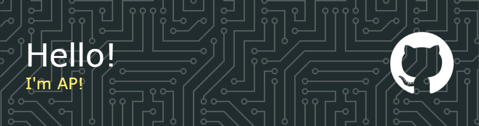

<!-- markdownlint-disable first-line-heading -->



## 🧔 About Me

```js
const aboutMe = {
  name: 'AP',
  pronouns: 'He/Him',
  status: 'First-year medical student',
  fieldsOfInterest: [
    'Bot development',
    'Web development',
    'Database management',
    'DevOps',
  ],
  askMeAbout: 'Merging man and machine',
  currentlyWorkingOn: 'A Discord bot',
  currentlyLearningAbout: 'Maintaining a repo',
  hobbies: [
    'Geopolitics',
    'Playing the piano',
    'Space',
    'Self-driving cars',
    'Educating',
  ],
  personalMotto: 'Weaknesses indicate strengths and strengths indicate weaknesses',
};
```

## 👨‍💻 Languages and Tools I Use

<div align="left">
  
  
  
  
  
  
  
  
  
  
  
  
  
  
  
  
  
  
  
  
  
  
  
  
  
  
  
  
  
  
  
  
  
  
  
  
  
</div>

## 📊 My Stats

<div align="left">
  
  
  
</div>

## 💬 Social Media

Connect with me on Discord at **`anipalur`**!
